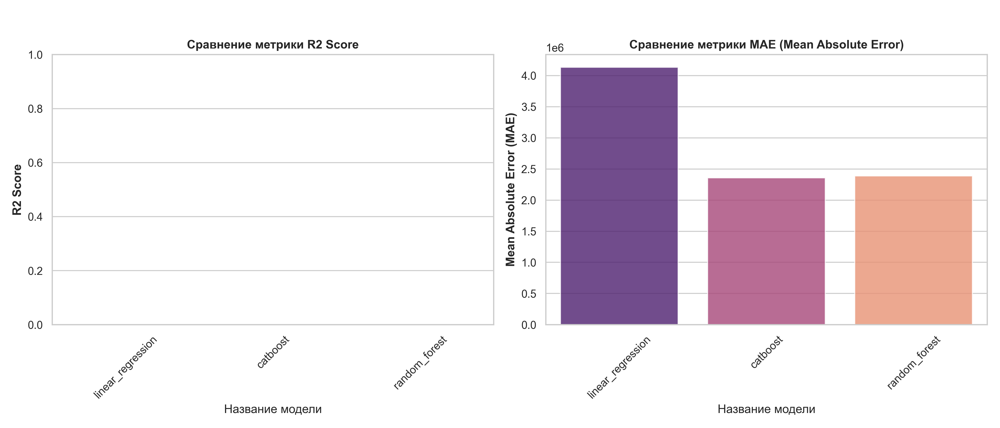

# Regression Model Comparison

This document provides a comparative analysis of the training results for three different regression models: **Linear Regression**, **CatBoost**, and **Random Forest**. The evaluation was based on two key metrics: the **Coefficient of Determination ($R^2$ Score)** and the **Mean Absolute Error (MAE)**.

---

## 1. Evaluation Results

The table below shows the numerical cross-validation results for each model.

| Model | Coefficient of Determination ($R^2$ Score) | Mean Absolute Error (MAE) |
| :--- | :--- | :--- |
| **linear\_regression** | $-0.6049$ | $4,980,536.0$ |
| **catboost** | $0.3856$ | $1,850,327.0$ |
| **random\_forest** | $-3.3399$ | $2,121,247.0$ |

---

## 2. Visual Comparison

The chart below displays the metric values for each model. The R2 Score axis (left) is represented by the blue bars, and the MAE axis (right) is represented by the red bars.

---

## 3. Performance Analysis

| Model | $R^2$ Score Analysis | MAE Analysis | Overall Conclusion |
| :--- | :--- | :--- | :--- |
| **linear\_regression** | **$-0.6049$ (Very Poor)**. A negative $R^2$ value means the model performs worse than simply predicting the mean of the target variable. | **$4,980,536.0$ (High)**. The highest error among all models, confirming its low performance. | **Worst Model**. Unsuitable for this task. |
| **catboost** | **$0.3856$ (Best Result)**. This is the only positive and the best $R^2$ Score. The model explains approximately 38.6% of the target variable's variance. | **$1,850,327.0$ (Lowest)**. The lowest error, making it the most accurate in terms of absolute deviation. | **Best Model**. Offers the strongest predictive power ($R^2$) and the smallest error (MAE). |
| **random\_forest** | **$-3.3399$ (Worst)**. An extremely low negative $R^2$ value indicates that the model is a very poor fit for the data. | **$2,121,247.0$ (Moderate)**. The error is higher than CatBoost's but lower than Linear Regression's. | **Poor Model**. Requires serious hyperparameter tuning or its pipeline is not working correctly. |

## Recommendation

The **CatBoost** model demonstrated the best performance across both metrics ($R^2$ and MAE). It is the **recommended choice** for further use or optimization based on these results.